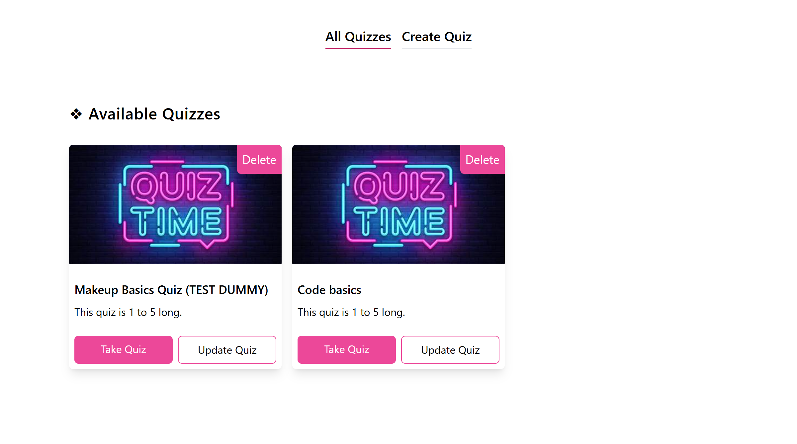
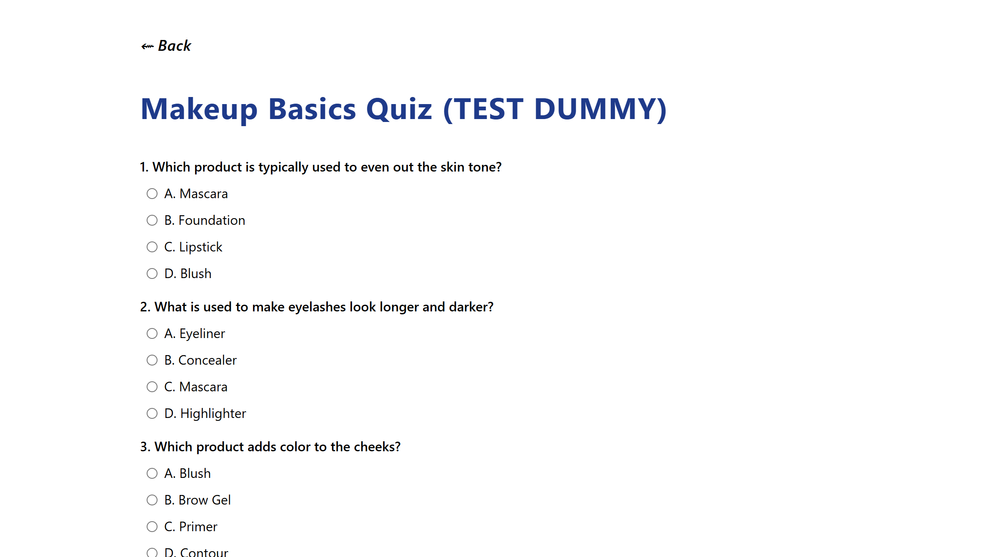

  
  

# Simple Quiz App
 - A simple quiz app that lets users create, update, delete, and take quizzes. They are also all stored in users browser’s local storage.

## Features
1. **Create Quizzes:** Add your own quizzes with custom questions and choices

2. **Update Quizzes:** Edit quiz title, questions, choices, and correct answers

3. **Delete Quizzes:** Remove quizzes you no longer need

4. **Take Quizzes:** Answer multiple-choice quizzes and see your score instantly

5. **Local Storage:** All data is saved on your device — no backend required

## Technologies
- HTML
- TailwindCSS
- JavaScript
- Jest
- Eslint
- NPM

